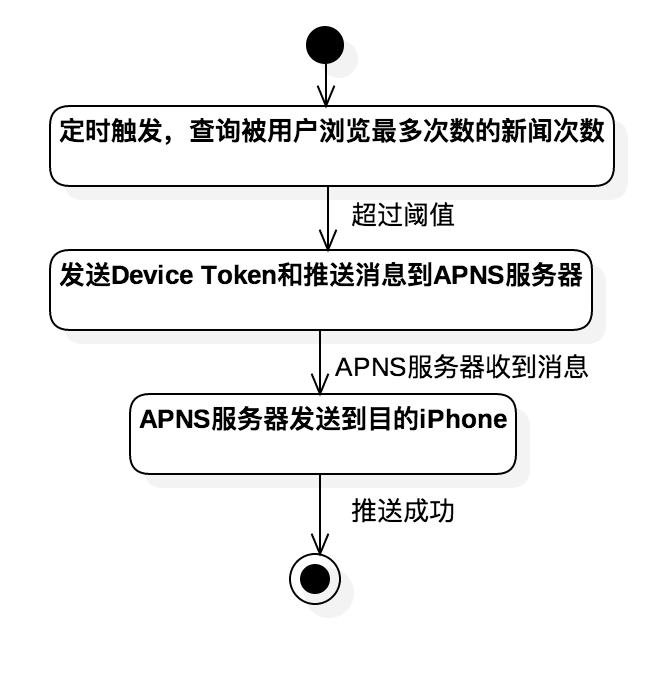

# 1. 引言 

当我们想要浏览一些新闻的时候，为保证资讯的真实和权威，往往会选择主流的新闻门户网站，但是这样的门户网站太多了，逐一浏览起来太过麻烦；另一方面，如果单纯选择搜索引擎来搜索想要的新闻，又需要排除来自一些不入流网站的信息。因此设计开发一个新闻聚合网站，能够定时到各主流新闻门户网站(新浪、搜狐、新华网、人民网等)抓取新闻，并展示给用户。

## 1.1. 目的 
让用户能够方便地一站浏览来自多个主流新闻门户网站的新闻资讯。使用户注册登录网站后，就能设置自己感兴趣的新闻栏目，并且在首页能够看到这些栏目的入口及相关热点新闻；另外，网站还必须具备一定的学习能力，例如在用户浏览过一些新闻以后能够给用户推荐相关新闻。

最后，本项目还会设计开发一个iOS客户端软件，能够发布和网站一样的新闻资讯，并且推送热点新闻。

## 1.2. 背景 
本项目是浙江大学B/S体系软件设计课程2017年春夏学期的课程项目
网站及对应客户端面向的用户群体是关注时事新闻的用户人群。

## 1.3. 预期读者
客户、项目经理、软件开发人员、测试人员。
# 2. 总体设计
## 2.1. 需求规定
### 2.1.1. 系统功能

网站及对应iOS客户端，都会提供下列界面：

- 首页，包括注册/登录的入口、各个新闻栏目的入口、用户感兴趣的新闻栏目入口、为用户推荐的新闻入口、当前热点新闻入口、搜索框
- 注册/登录页面
- 单一新闻栏目展示，展示该新闻栏目的最新相关新闻列表，在这个页面，用户可以选择将这个新闻栏目添加至感兴趣的栏目集或从感兴趣的栏目集中删除
- 为用户推荐的新闻，展示为用户推荐的最新热点新闻列表
- 当前热点新闻，不限新闻栏目，展示最新最热的新闻列表
- 新闻列表包括新闻标题、摘要、图片，点击即进入正文页面
- 正文页面，单个新闻展示，包括标题、摘要、来源、图片、正文等信息

另外，对应iOS客户端需要对热点新闻进行推送

### 2.1.2. 系统性能

本系统的性能将由用户请求等待时间及高并发数情况下服务器吞吐率决定。

数据库连接性能方面，在Spring下使用第三方包装的数据库连接池来以提高数据库的访问效率，尽量减少连接的创建和关闭，对于数据库查询尽可能做优化、合理使用索引；

在网页客户端对常用功能进行缓存处理，使用Ajax缓存方案减轻服务器压力。并将js脚本放置在文档最后面以让页面加载更快；

本系统提供用户友好的界面，尽可能做到界面简洁、美观，以提升用户体验。

### 2.1.3. 安全性需求

- 用户注册需要用email验证，以防止恶意大量注册
- 需要保证用户密码在6字节以上
- 利用验证码防止自动程序提交垃圾信息
- 对数据库设置达到一定强度的密码，并在网站维护过程中定期修改密码
- 过滤、审核用户的输入来防止SQL注入的攻击

### 2.1.4. 输入输出要求

网页前端采用bootstrap框架开发，用户的输入主要是登录/注册时输入表单提交、搜索新闻时输入查询关键词、点击按钮或链接以跳转到其他页面。后端分为两个部分：定期在各大新闻门户网站抓取新闻资讯，还有和前端进行交互，其中包括处理来自网页前端的数据、查询和更新数据库、将结果返回给前端显示等等。

## 2.2. 开发环境

### 2.2.1. 前端框架

前端使用Bootstrap作为框架。Bootstrap是目前最受欢迎的前端框架，基于 HTML、css、javascript 开发，简洁、灵活，而且兼容主流浏览器，使Web前端开发更加快捷。

开发工具：WebStorm

### 2.2.2. 后端框架

后端使用Spring MVC作为框架，它是SpringFrameWork的后续产品，在Model、View和Controller三个模块提供了一个非常清晰的划分，而且还有灵活的配置功能，能够把各种类当做Bean来通过XML进行配置。

另外，Spring提供了大量的控制器接口和实现类，通过依赖注入和面向接口实现松散耦合；它还提供方便的单元测试和管理机制，这让后端开发更加简单和快捷。

而且，Spring MVC中的View模块也可以很方便地利用Bootstrap作为前端框架实现。

最后，由于本项目需要定时到各大新闻门户网站爬取新闻资讯，所以使用Spring整合Quartz实现定时爬取新闻资讯并存在原始文章数据表内的任务。

开发工具：IntelliJ IDEA

### 2.2.3. 移动客户端

实现iPhone客户端软件，功能同网站，但显示界面必须根据屏幕大小做自适应调整，为开发简单，只使用WebView来实现网站的功能，并在CSS文件尾部增加针对不同屏幕宽度的规则。 

对于实现热点新闻的推送，将会设计成应用服务端定时发送消息到Apple的APNS服务器，从而发送消息到iPhone，然后iPhone把消息传递给app，并按照设定弹出推送通知。

开发工具：Xcode

### 2.2.4. 服务器

使用Apache Tomcat8.5作为服务器，Tomcat是一个免费的开源Web服务器，能够处理HTML页面，另外还是一个Servlet的容器。使用Spring MVC完成前端和后端的开发后，可以把发布的内容拷贝到Tomcat下，使用Tomcat启动。

### 2.2.5. 数据库

MySQL5.7，MySQL 是最流行的关系型数据库管理系统之一，其功能应用于中小型企业级应用绰绰有余。而从MySQL5.7开始，内置了ngram全文检索插件，用来支持中文分词，并且对MyISAM和InnoDB引擎有效。

### 2.2.6. 支持软件

压力测试工具：LoadRunner

网页浏览器：Safari、Chrome、Firefoxd等多浏览器支持

移动客户端：iOS

### 2.2.7. 基本设计

| 模块            | 处理流程                                     |
| ------------- | ---------------------------------------- |
| 前端网页          | 使用bootstrap框架进行页面设计，为用户相应的交互操作编写js脚本对用户的输入进行处理，向服务器发送请求、取得数据，并进行相应显示 |
| Web后端         | 使用Spring MVC框架合理规范Model、View和Controller的运作，对来自View的请求进行响应、通过JDBC连接数据库进行查询和更新等操作，再返回给View，注意每次用户浏览一则新闻都应在浏览记录的表内新增一条内容 |
| 应用服务器——爬取新闻资讯 | 使用Spring整合Quartz，定时从各大新闻门户网站爬取新闻资讯并存储在数据表内 |
| 应用服务器——热点新闻推送 | iOS app注册APNS消息推送功能后，会得到相应的Device Token。使用Spring整合Quartz，发现热点新闻并将推送消息以及Device Token打包发送给APNS服务器，APNS将会将消息推送给目的iPhone |

# 3. 详细设计

## 3.1. 抓取新闻资讯

### 3.1.1. 模块描述

本模块运行在应用服务器端，利用Spring整合Quartz，定时从各大新闻门户网站爬取新闻资讯并存储在数据表内。

### 3.1.2. 功能

需要对不同新闻门户网站按照其HTML组成进行爬取，包括新闻发布时间、来源、所属新闻栏目、标题、正文等信息，另外需要在MySQL中对标题和正文建立全文索引以为实现搜索功能做铺垫。

### 3.1.3. 性能

每隔一段时间使用jsoup进行爬取，jsoup是Java的一种HTML解析器，可直接解析个URL地址相应的HTML文本内容，同时提供API，可以很容易地通过DOM对象取出数据。

### 3.1.4. IPO图


### 3.1.5. 设计方法

使用jsoup从新闻门户网站的首页开始爬取，只爬取指定时间段内的新闻资讯，将新闻标题作为数据表中的title字段，所属新闻栏目作为column，发布时间作为time，来源名称及来源地址作为source_name和source_url，正文内容作为body，注意将正文内容存作html格式（也就是一段文字存在`<p>`标签内，一张图片存在``标签内，按照行文顺序排列下来，这样最后就能很方便地显示在这个新闻聚合网站上，想要统一格式也只需要改动css文件就可以了），然后把一则这样的新闻存人数据表内，就可以得到这则新闻独一无二的文章编号news_id，注意来源地址必须是唯一的，因为不同新闻门户网站可能同时转载了另外一个网站上同一则新闻资讯，而用户不希望看到两篇完全一样的文章。

### 3.1.6. 流程逻辑


### 3.1.7. 测试方法

指定新闻门户网站首页URL后，程序能实现每隔一段时间爬取一段时间范围内的数据并存入数据库，因此在数据库中查看是否爬取到不同时间范围内的新闻资讯记录。

## 3.2. 注册和登录

### 3.2.1. 模块描述

本模块实现用户注册、登录功能。

### 3.2.2. 功能

用户注册时需要填写必要的信息并验证，用户名、密码要求在 6 字节以上，并以email 的格式验证，并保证用户名和 email 在系统中唯一，用户成功注册后必须在数据库用户表中增加一条记录，并且生成激活码，发送验证邮件到用户邮箱，在待激活用户中增加一条记录，在。用户登录时在数据库中查询，以验证密码是否匹配，从而进行后面的操作。

### 3.2.3. 性能

直接使用jQuery保证用户名、密码在6字节以上，使用Spring MVC框架实现和前端的交互，使用内部封装的JDBC实现数据库的连接和查询、更新，利用Service实现激活码生成与邮件验证。

### 3.2.4. IPO图


### 3.2.5. 设计方法

直接使用jQuery的validate方法保证用户名、密码在6字节以上、12字节以下，保证注册时两次输入密码必须相同；使用Spring MVC框架编写User模型类，并编写UserController类、利用bootstrap框架编写userview.jsp实现表单元素的数据绑定和使用。并使用Spring框架中的Service专门处理生成激活码及发送邮件的操作，同时把用户id和激活码存在数据库待激活用户表中，每次登录，如果用户名、密码匹配，都会查询用户id是否在待激活用户表中，如果在，用户必须输入正确激活码才能成功登录，否则网站`<session>`中不会存入用户信息，也不能使用登录用户的功能，如果激活成功，就在待激活用户表中删除这个用户id的记录，`<session>`中存入用户信息。

### 3.2.6. 流程逻辑


### 3.2.7. 测试方法

1. 用户输入表单信息注册后，查看是否能够检测出用户名、密码不合规范、用户名、邮箱在系统中不唯一；
2. 如果符合要求，查看是否收到激活邮件；
3. 再次使用之前填写的用户名、密码是否能成功登录；
4. 是否显示出激活页面；
5. 填入激活邮件是否能激活；
6. 激活成功后是否`<session>`中有用户信息；
7. 再次登录是否还需要激活，`<session>`中是否有用户信息。

## 3.3. 设置感兴趣的新闻资讯栏目

### 3.3.1. 模块描述

用户登录后可以设置感兴趣的新闻资讯栏目，用户访问网站的展示页面会根据用户设置做出相应的调整。

### 3.3.2. 功能

实现用户感兴趣新闻资讯栏目的设置，用户可以在某一新闻栏目的首页通过按钮选择把这个栏目加入关注，设置以后将在数据库中新增记录，如果这个新闻栏目已经被关注，则在对应栏目首页会有取消关注的按钮；

每次用户登录以后访问首页，有一块专门的区域显示用户设置的栏目的入口及对应的热门新闻资讯标题，如果还没有设置过，就做出相关提醒；而且用户还可以通过侧边栏导航进入"关注栏目"，显示用户设置的新闻资讯栏目的入口及对应的更多热门新闻资讯标题，还可以通过栏目入口旁边的按钮在这个页面取消对一些栏目的关注，同时在数据库中删除对应栏目的记录。

### 3.3.3. 性能

使用Spring MVC框架实现和bootstrap前端的交互，使用内部封装的JDBC实现数据库的连接和查询、更新，编写相应的Controller类处理来自前端的请求，并完成相应操作。

### 3.3.4. IPO图


### 3.3.5. 设计方法

使用Spring MVC框架编写关注栏目的FavoriteColumnController来实现和bootstrap前端的交互，每次加载页面就查询数据库并进行相应显示，并对用户取消关注的操作在数据库中做出相应的删除操作；在所有新闻栏目的首页ColumnController添加对“关注栏目”/"取消栏目"按钮的响应，也需要在数据库做出相应的增删操作。

利用每次加载“关注栏目”网页或加载首页的“关注栏目”区域，就根据用户session向数据库查询查询这个用户关注的新闻栏目链接，以及数条这个栏目最新的新闻资讯及链接并进行显示，注意新闻栏目链接旁边需要有一个“取消关注”的按钮，用户按下后会从数据库关注栏目的表中删除这个用户关注这个栏目的记录，同时页面刷新，关注列表中就不再显示这个栏目了。

当用户进入某一新闻栏目的首页时，如果这个栏目是用户已关注的，也会显示一个“取消关注”的按钮，按下后也会删除这个记录，同时按钮变为“加入关注”；反之显示“加入关注”按钮，按下后新增一条当前用户关注这个栏目的记录，同时按钮变为“取消关注”。

### 3.3.6. 流程逻辑

### 3.3.7. 

### 3.3.8. 测试方法

1. 进入某一新闻栏目首页，查看是否显示“取消关注”/“加入关注”按钮；
2. 点击“取消关注”/“加入关注”按钮，查看按钮是否变化；
3. 进入“关注栏目”页面，查看是否能按照已经关注的栏目进行显示；
4. 查看每个栏目入口旁边是否有“取消关注”的按钮；
5. 点击“取消关注”按钮后，查看页面是否自动刷新，这个新闻栏目是否已经消失。


## 3.4. 新闻推荐 

### 3.4.1. 模块描述

使系统具备一定的学习能力，能根据用户的浏览记录为用户推荐还没有浏览过的文章。

### 3.4.2. 功能

具有一定的学习能力，能根据用户的浏览记录为用户推荐文章。

### 3.4.3. 性能

使用Spring MVC框架实现和bootstrap前端的交互，使用内部封装的JDBC实现数据库的连接和查询、更新，编写相应的Controller类处理来自前端的请求，并完成相应操作。另外推荐系统使用lenskit配置JDBCRatingDAO，可以很方便地推荐出指定书目的文章。

### 3.4.4. IPO图


### 3.4.5. 设计方法

使用Spring MVC框架编写新闻推荐栏目的的RecommendController来实现和bootstrap前端的交互，每次加载“为您推荐”页面，就查询数据库用户最新浏览的数条文章和数据库中所有文章，通过lenskit可以得到数条推荐新闻资讯（如果发现加载速度太慢可以考虑新建一张表存储为所有用户推荐的文章，定时更新表，这样每次加载页面只需要在数据库中查询就够了）


### 3.4.6. 流程逻辑


### 3.4.7. 测试方法

打开“为您推荐”页面查看是否能显示出与之前浏览过的文章类似的文章，还有加载速度如何。


## 3.5. 移动客户端

### 3.5.1. 模块描述

实现iPhone客户端软件，功能同网站，但展示界面根据屏幕大小做 UI 的自适应调整，并能实现热点新闻推送。

### 3.5.2. 功能

在iPhone客户端上使用一个WebView，网页UI配置成能够根据屏幕宽度选择使用合适的css。并能检测出热点新闻推送给用户。

### 3.5.3. 性能

首先，iOS app需要注册APNS消息推送功能，则可以得到一个Device Token。

使用Spring整合Quartz，定时查询数据库中用户浏览记录，如果被用户浏览次数最多的新闻浏览次数超过指定阈值，就将推送消息及Device Token打包发送给APNS服务器，APNS将会将消息推送给目的iPhone。

### 3.5.4. IPO图


### 3.5.5. 设计方法

在iPhone客户端中使用WebView完成对网站的访问，同时网站样式需要设置成根据屏幕宽度决定选用的css文件，对手机屏幕设计适合的UI界面；

注册APNS消息推送功能后，得到Device Token备用；Spring MVC整合Quartz，定时查询用户浏览记录，浏览次数最多的新闻可能是热点新闻，如果浏览次数超过指定阈值就认为是热点新闻，则进行远程推送：发送推送消息及Device Token打包发送给APNS服务器，则APNS将会完成推送。

### 3.5.6. 流程逻辑



### 3.5.7. 测试方法

1. 测试查询到的最多浏览次数是否正确；
2. 设置合适的阈值以后，测试是否能在iPhone上收到推送消息。


# 4. 用户接口

## 4.1. 系统界面

### 4.1.8. 正文显示

如下图所示，点击左上角的汉堡包标志则侧边栏从左侧滑出


### 4.1.9. 登录/注册界面


### 4.1.10. 侧边栏

#### 4.1.10.1. 登录前


#### 4.1.10.2. 登录后


### 4.1.11. 移动客户端界面


## 4.2. 内部接口

不同模块通过Spring MVC与 MySQL 建立连接	，通过对数据的增删改进行相应的更新，同时还共享当前session。


# 5. 数据库设计

爬取过的网站crawled:

| 名称   | 类型           | 属性     | 备注    |
| ---- | ------------ | ------ | ----- |
| url  | varchar(100) | unique | 网页url |

新闻资讯表news：

| 名称          | 类型           | 属性                      | 备注   |
| ----------- | ------------ | ----------------------- | ---- |
| news_id     | int          | not null AUTO_INCREMENT | 文章编号 |
| url         | varchar(100) | not null                | URL  |
| time        | datetime     | not null                | 时间   |
| source_name | varchar(20)  | null                    | 来源名称 |
| source_url  | varchar(100) | unique                  | 来源链接 |
| news_column | varchar(4)   | null                    | 新闻栏目 |
| title       | varchar(50)  | not null                | 标题   |
| body        | text         | not null                | 正文   |

其中:
```sql
FULLTEXT (title,body) WITH PARSER ngram
```

用户表user：

| 名称       | 类型          | 属性       | 备注   |
| -------- | ----------- | -------- | ---- |
| user_id  | varchar(16) | unique   | 用户id |
| password | varchar(16) | not null | 用户密码 |
| email    | varchar(30) | unique   | 用户邮箱 |

待激活用户表activating_users：

| 名称              | 类型          | 属性       | 备注   |
| --------------- | ----------- | -------- | ---- |
| user_id         | varchar(16) | unique   | 用户id |
| activation_code | varchar(6)  | not null | 激活码  |

用户感兴趣的新闻栏目表favorite_columns：

| 名称          | 类型          | 属性       | 备注   |
| ----------- | ----------- | -------- | ---- |
| user_id     | varchar(16) | not null | 用户id |
| news_column | varchar(4)  | not null | 新闻栏目 |

用户浏览记录表browse_history：

| 名称      | 类型          | 属性       | 备注   |
| ------- | ----------- | -------- | ---- |
| user_id | varchar(16) | not null | 用户id |
| news_id | int         | not null | 新闻id |
| time    | datetime    | not null | 浏览时间 |

# 遇到的问题
## MySQL全文索引
在使用全文索引的过程中，由于MySQL的默认ft_min_word_len是4，不适用于中文索引，所以需要改成1，但是我的MySQL是用Homebrew安装的，网上查到的方法很多都不适用，花了很长时间找到了以下解决办法：
1. `mysql.server stop`
2. 用`which mysql`找到mysql快捷方式，再找到运行目录，我的是`/usr/local/Cellar/mysql/5.7.17/bin`
3. `./mysqld_safe --ft_min_word_len=1 &`
4. 上一步可能会遇到`mysqld_safe A mysqld process already exists`的问题，我的方法是直接找到mysqld进程kill掉，动作要快，kill成功之后马上运行这条命令，否则这个进程很快又会启动
5. `mysql.server start` (先把前一个mysqld进程kill掉)
6. `SELECT title FROM `news` WHERE MATCH(`title`) AGAINST('*加多宝*' IN BOOLEAN MODE);`不加`*`和`IN BOOLEAN MODE`会搜索不到内容
